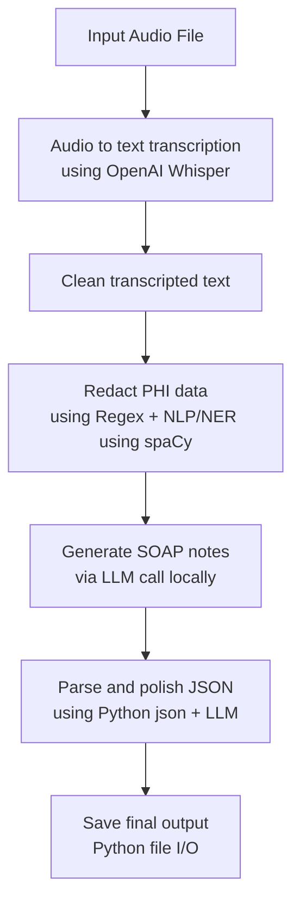

# Safeguarding PHI in the AI Era: SOAP Notes Transcription & Generation with OpenAI Whisper, NLP/NER, and LLMs locally

## Description
Transcribe medical audio locally using OpenAI Whisper, redact PHI from transcript text using NLP/NER, and generate a structured SOAP note (`Subjective`, `Objective`, `Assessment`, `Plan`) using a local LLM.

## Objective
To build a privacy-first Clinical System that:
- transcribes medical audio locally and accurately.
- redacts Protected Health Information (PHI) from transcripts using regex and NLP/NER.
- generates structured SOAP notes locally with LLMs without sending patient data to external cloud services.

## Flowchart



## Tech Stack

- Python 3.10+
- OpenAI Whisper (local transcription)
- spaCy (NLP/NER for PHI redaction)
- Ollama (local LLM serving)
- Llama 3.1 model on Ollama (default: `llama3.1:8b`)
- ffmpeg (audio decoding)

## Libraries Required

From `requirements.txt`:
- `openai-whisper`
- `ollama`
- `requests>=2.31.0`
- `spacy>=3.7.0`

## Sample audio files
Supported audio files : mp3, m4a, etc.
Two audio files dataset named audio.mp3 and audio1.mp3 are provided in data directory.

## System tools:
- `ffmpeg`
- `ollama` CLI/runtime

## Installation

### 1. Clone and enter project

```bash
git clone https://github.com/amankiit/SOAP-Notes-Generation-with-OpenAI-Whisper-NLP-NER-and-LLMs-locally.git
cd SOAP-Notes-Transcription-locally-using-OpenAI-Whisper-NLP-for-PHI-redaction-Ollama
```

### 2. Create virtual environment

```bash
python3 -m venv .venv
source .venv/bin/activate
```

### 3. Install Python dependencies

```bash
pip install -r requirements.txt
```

### 4. Install spaCy English model

```bash
python -m spacy download en_core_web_sm
```

### 5. Install ffmpeg

macOS (Homebrew):

```bash
brew install ffmpeg
```

### 6. Install and start Ollama

Install Ollama from: `https://ollama.com`

Pull the default model:

```bash
ollama pull llama3.1:8b
```

## Running

### Default run

```bash
python3 main.py
```

### Run with custom audio

```bash
python3 main.py data/audio1.m4a
```

### Run with larger Whisper model (better accuracy)

```bash
python3 main.py data/audio1.m4a --whisper-model medium
```

### Disable PHI redaction (not recommended)

```bash
python3 main.py data/audio1.m4a --no-redact-phi
```

### Print transcript in console

```bash
python3 main.py data/audio1.m4a --print-transcript
```

## Prompt Configuration

All prompts are now configured in `config.py`:

- `SYSTEM_PROMPT`:
  global guardrails for the main SOAP generation call (JSON-only, exact keys, no extra text).
- `SOAP_PROMPT_TEMPLATE`:
  primary task prompt used to convert transcript text into SOAP JSON.
- `SOAP_POLISH_PROMPT_TEMPLATE`:
  second-pass refinement prompt used to polish grammar/spelling without changing clinical meaning.

Use cases:
- Edit `SOAP_PROMPT_TEMPLATE` when you want to change SOAP writing style/content behavior.
- Edit `SOAP_POLISH_PROMPT_TEMPLATE` when you want to tighten or relax post-processing cleanup.
- Keep `SYSTEM_PROMPT` short and strict for output-format safety.

## Output

The script writes two files:

1. `output.json` (core application output)
- `audio_file`
- `transcript` (redacted unless disabled)
- `soap_note` with keys:
  - `Subjective`
  - `Objective`
  - `Assessment`
  - `Plan`

2. `output.fhir.json` (HL7 FHIR R4-style document bundle)
- `resourceType`: `Bundle`
- `type`: `document`
- `entry` contains:
  - `Composition` with SOAP sections
  - `Patient` placeholder resource

## Notes

- If spaCy model is missing, PHI redaction quality may degrade.
- For better transcription quality, prefer `--whisper-model medium` or `large`.
- Keep local models updated for best SOAP generation quality.

## Output Format

### output.json

```json
{
  "audio_file": "data/audio.mp3",
  "transcript": "...",
  "soap_note": {
    "Subjective": "...",
    "Objective": "...",
    "Assessment": "...",
    "Plan": "..."
  }
}
```

### output.fhir.json

```json
{
  "resourceType": "Bundle",
  "type": "document",
  "timestamp": "2026-05-25T12:00:00Z",
  "entry": [
    {
      "fullUrl": "urn:uuid:soap-composition",
      "resource": {
        "resourceType": "Composition",
        "id": "soap-composition",
        "status": "final",
        "type": {
          "coding": [
            {
              "system": "http://loinc.org",
              "code": "34133-9",
              "display": "Summarization of episode note"
            }
          ]
        },
        "subject": {
          "reference": "Patient/example-patient"
        },
        "title": "SOAP Clinical Note for audio.mp3",
        "section": [
          { "title": "Subjective", "text": { "status": "generated", "div": "<div xmlns='http://www.w3.org/1999/xhtml'><p>...</p></div>" } },
          { "title": "Objective", "text": { "status": "generated", "div": "<div xmlns='http://www.w3.org/1999/xhtml'><p>...</p></div>" } },
          { "title": "Assessment", "text": { "status": "generated", "div": "<div xmlns='http://www.w3.org/1999/xhtml'><p>...</p></div>" } },
          { "title": "Plan", "text": { "status": "generated", "div": "<div xmlns='http://www.w3.org/1999/xhtml'><p>...</p></div>" } }
        ]
      }
    },
    {
      "fullUrl": "urn:uuid:example-patient",
      "resource": {
        "resourceType": "Patient",
        "id": "example-patient"
      }
    }
  ]
}
```
