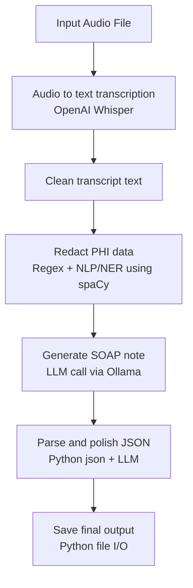

# AI-powered SOAP Notes Transcription

## Description
Transcribe medical audio locally using OpenAI Whisper, redact PHI from transcript text using NLP/NER, and generate a structured SOAP note (`Subjective`, `Objective`, `Assessment`, `Plan`) using a local LLM.

Supported audio files : mp3, m4a, etc.

## Flowchart



## Tech Stack

- Python 3.10+
- OpenAI Whisper (local transcription)
- spaCy (NLP/NER for PHI redaction)
- Ollama (local LLM serving)
- Llama 3.1 model on Ollama (default: `llama3.1:8b`)
- ffmpeg (audio decoding)

## Libraries Required

From `requirements.txt`:
- `openai-whisper`
- `ollama`
- `requests>=2.31.0`
- `spacy>=3.7.0`

System tools:
- `ffmpeg`
- `ollama` CLI/runtime

## Installation

### 1. Clone and enter project

```bash
git clone <your-repo-url>
cd SOAP-Notes-Transcription-locally-using-OpenAI-Whisper-NLP-for-PHI-redaction-Ollama
```

### 2. Create virtual environment

```bash
python3 -m venv .venv
source .venv/bin/activate
```

### 3. Install Python dependencies

```bash
pip install -r requirements.txt
```

### 4. Install spaCy English model

```bash
python -m spacy download en_core_web_sm
```

### 5. Install ffmpeg

macOS (Homebrew):

```bash
brew install ffmpeg
```

### 6. Install and start Ollama

Install Ollama from: `https://ollama.com`

Pull the default model:

```bash
ollama pull llama3.1:8b
```

## Running

### Default run

```bash
python3 main.py
```

### Run with custom audio

```bash
python3 main.py data/audio1.m4a
```

### Run with larger Whisper model (better accuracy)

```bash
python3 main.py data/audio1.m4a --whisper-model medium
```

### Disable PHI redaction (not recommended)

```bash
python3 main.py data/audio1.m4a --no-redact-phi
```

### Print transcript in console

```bash
python3 main.py data/audio1.m4a --print-transcript
```

## Output

The script writes `output.json` with:
- `audio_file`
- `transcript` (redacted unless disabled)
- `soap_note` with keys:
  - `Subjective`
  - `Objective`
  - `Assessment`
  - `Plan`

## Notes

- If spaCy model is missing, PHI redaction quality may degrade.
- For better transcription quality, prefer `--whisper-model medium` or `large`.
- Keep local models updated for best SOAP generation quality.

## Output Format

The script writes JSON like this:

```json
{
  "audio_file": "data/audio.mp3",
  "transcript": "...",
  "soap_note": {
    "Subjective": "...",
    "Objective": "...",
    "Assessment": "...",
    "Plan": "..."
  }
}
```